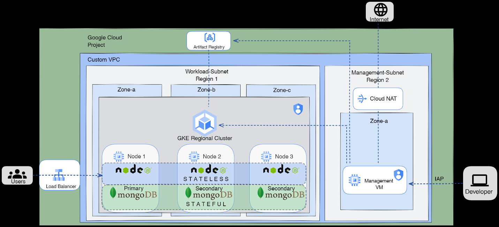
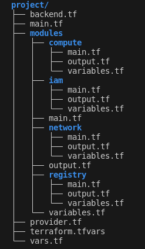
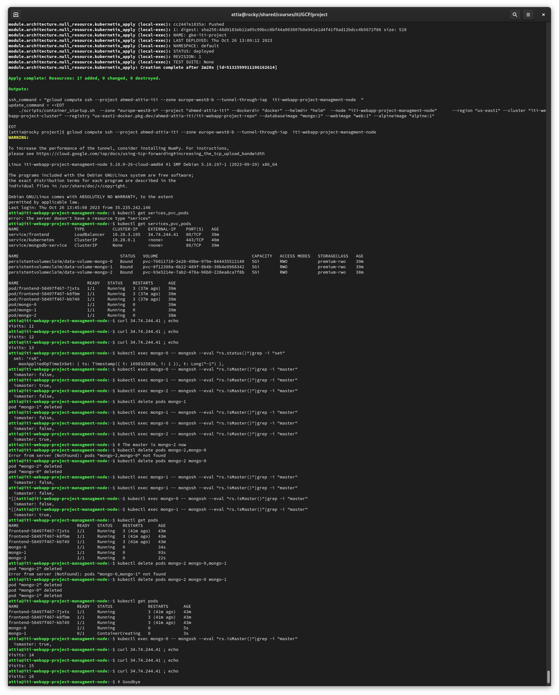

# Simple Web App Deployed on GKE through Terraform

## Main Features

This project is about a simple two-tier application that offers the following features:

1. The entire architecture is deployed through Terraform only, with no need for external intervention.
2. The two-tier application consists of a simple frontend application and a MongoDB backend.
3. The frontend is private and can be accessed through the automatically provisioned load balancer.
4. The frontend and the backend are highly available on a multi-zone GKE cluster.
5. The database storage is persistently maintained with enabled replication mode by default, with a total of 3 replicas.
6. The Kubernetes cluster is kept private with limited access through the management node.
7. The management node is a private node (with no internet access) but can be securely reached through IAP (Identity-Aware Proxy).
8. The cluster and the management nodes are kept in 2 different regions entirely.
9. The Kubernetes manifest files are maintained through Helm for better and easier management.



## Infrastructure as Code (Terraform)

I have used cascaded modules to increase modularity, and the entire infrastructure can be deployed through the modules only.



## Setup Process

### Adding Your Project Name

Change the variable "project" in the `terraform.tfvars` file to your `project_id`.

If you want to add a Service Account key for Terraform to use, then uncomment the credentials line and add the credentials_key_path.

### Authentication

```bash
gcloud auth login

# Set the default project
gcloud config set project "project_id"

# Create the bucket for the backend tfstate file
gsutil mb "gs://iti_gke_terraform_state"

# Initialize Terraform
terraform init
```
# Deploying the Infrastructure and Automatic Setup

The architecture is deployed with the following command:

```bash
terraform apply
```

## Testing and Access to the App Deployed on GKE
 


### Access the Management Instance through the output command given by Terraform

```bash
gcloud compute ssh --project "project-id" --zone "zone-id" --tunnel-through-iap  iti-webapp-project-managment-node
```

### Check the Running Pods

```bash
kubectl get pods
kubectl get services
curl "ip_of_the_load_balancer"
```

## [Deployed Infrastructure Sample](/architecture_info/)