# Terraform Setup 

## Terraform Remote Bucket 

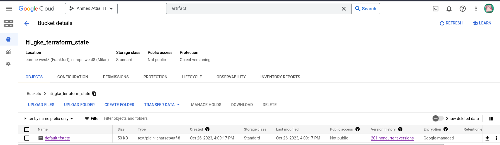

## Terraform used service accounts

one for bucket access and the other for applying the infrastructure

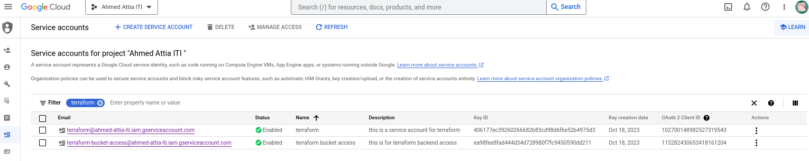

## Terraform Acting Infrastructure Creation Service Account's Roles And Permmissions

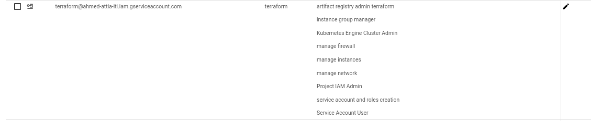

##  Terrform Acting Permissions (for Applying and Destroying the infrastructure)

## Terraform Bucket Access on the level of the bucket itself 

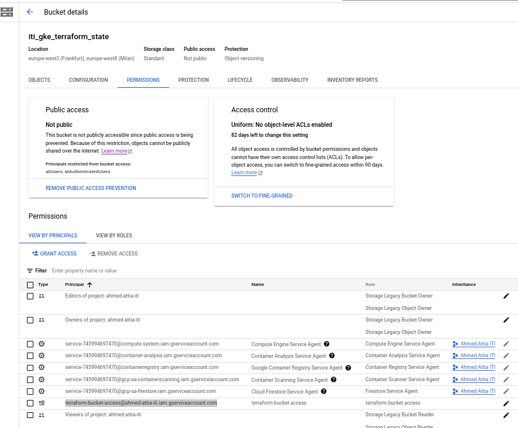

# NETWORK

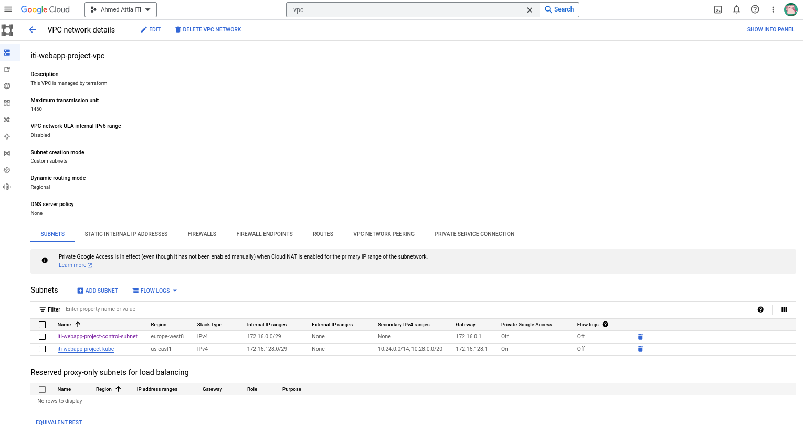

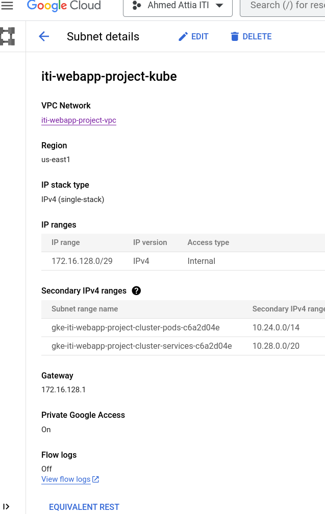

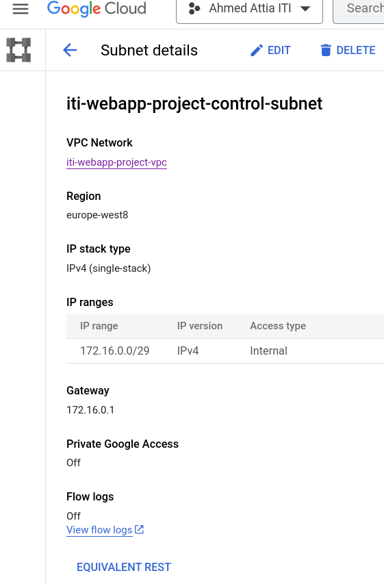

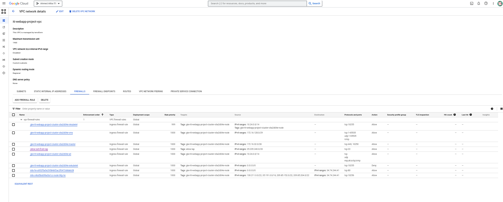

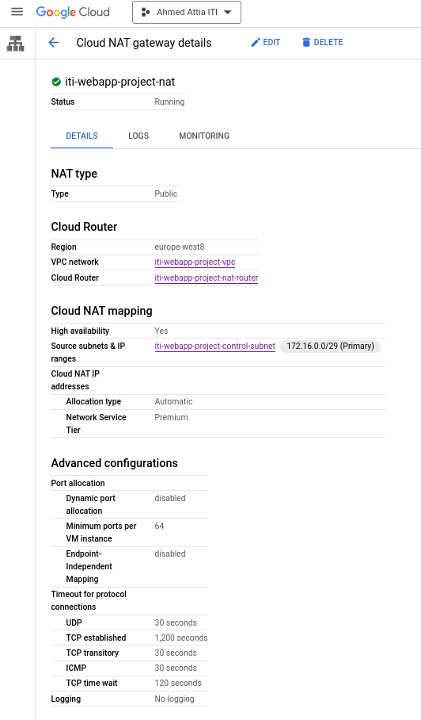

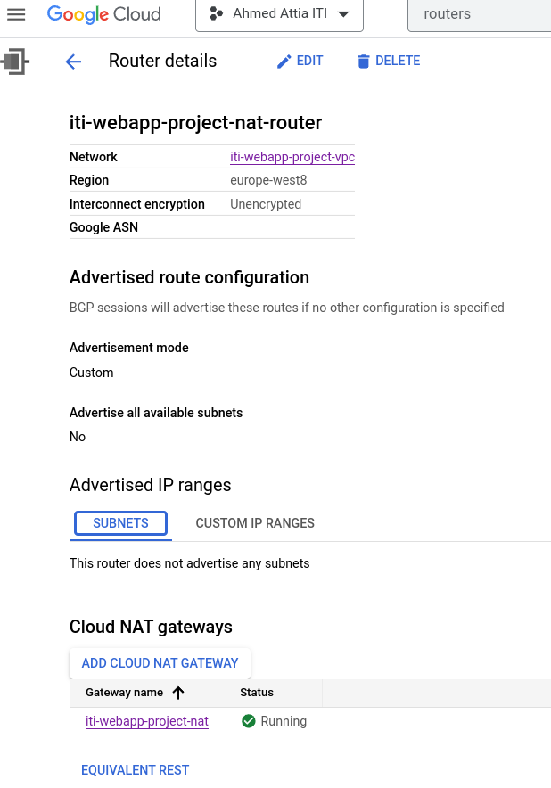

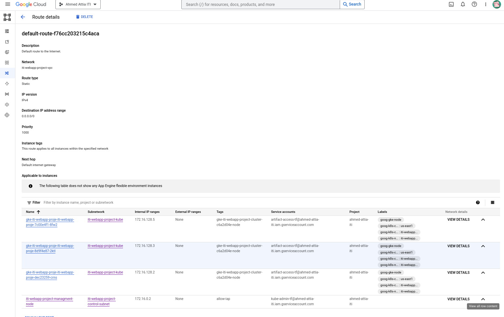 

# IAM Permssions

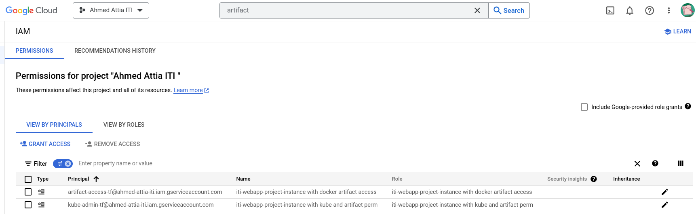

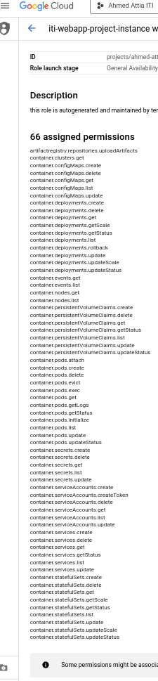 

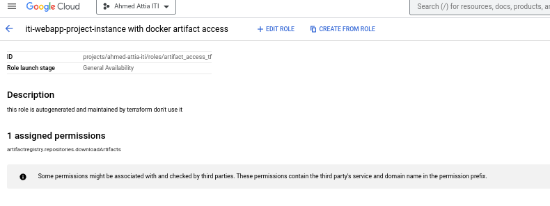 

# Compute Instance And Managment Node

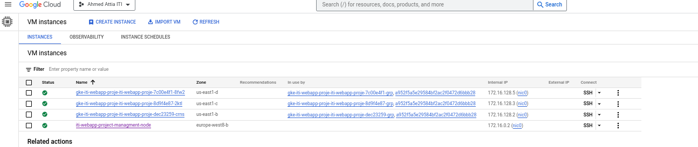 

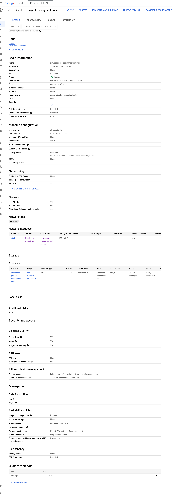

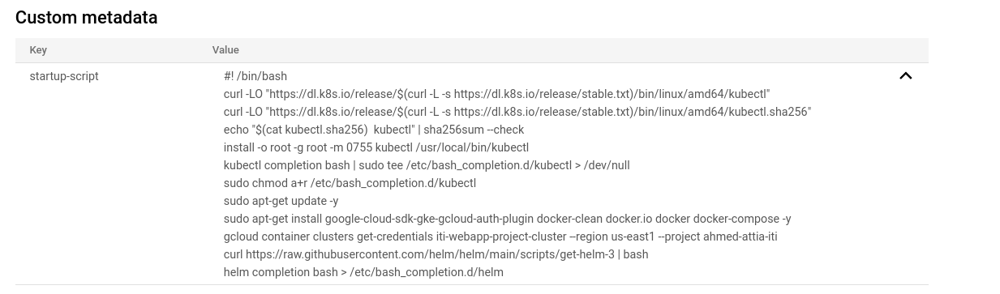

# GKE 

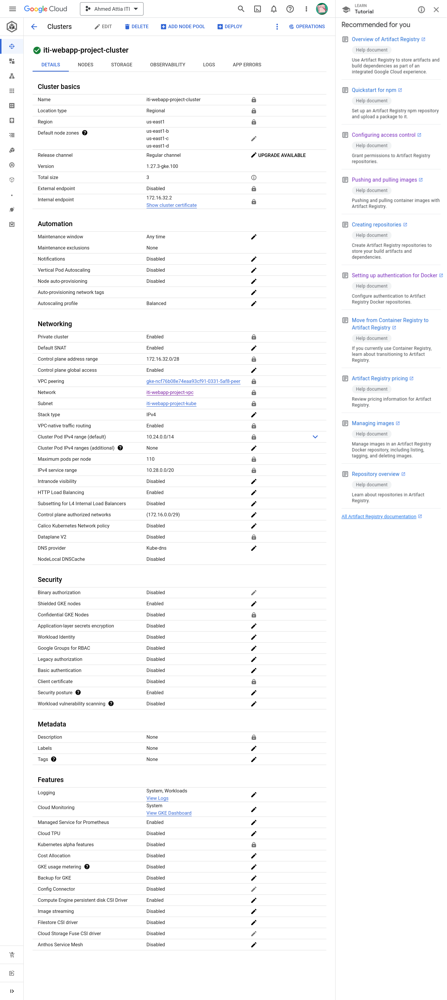

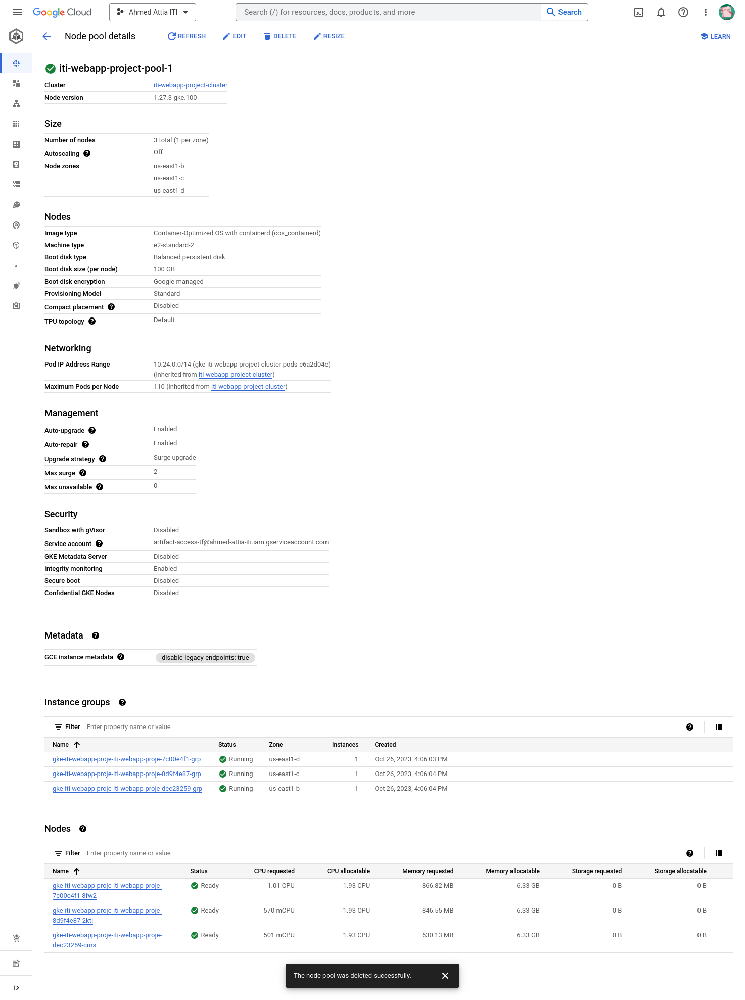 

# Application

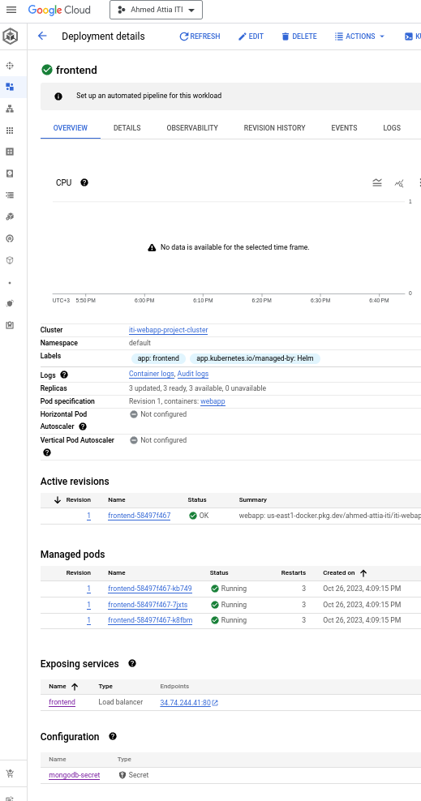

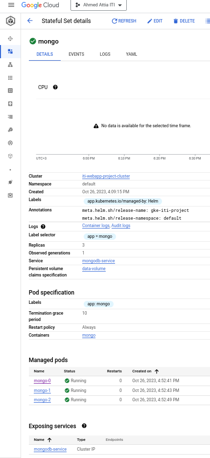

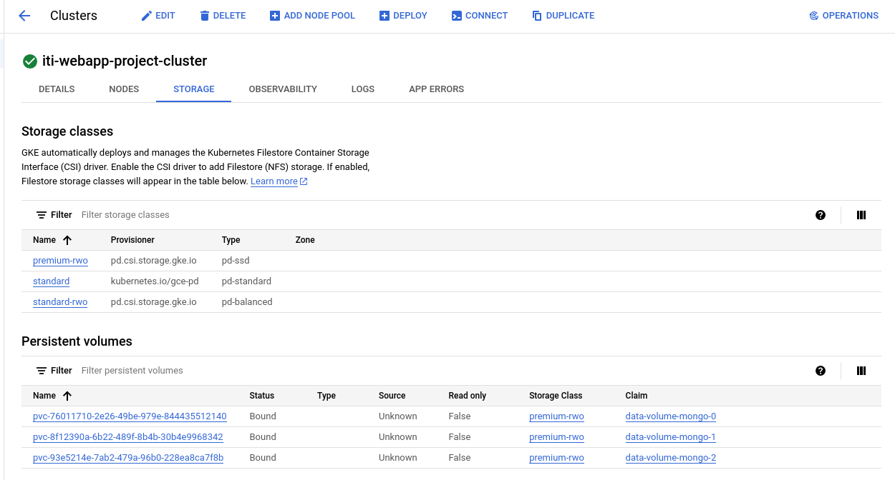

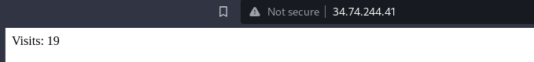